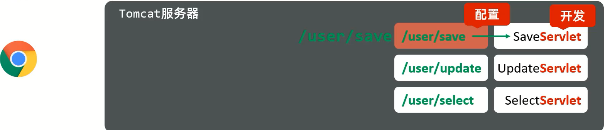
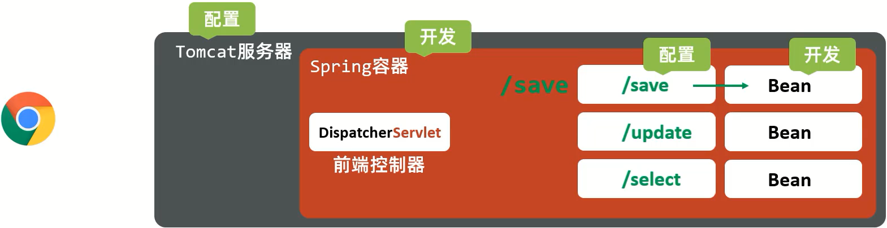

SpringMVC是一个Web框架，将来是要替换之前我们所使用的Servlet,所以我们先来回顾下以 前Servlet是如何进行开发的:

### Servlet

1.浏览器发送请求到Tomcat服务器;

2.Tomcat服务器接收到请求后，会根据请求路径来匹配对应的Servlet,并将请求交给对应的Servlet来处理

所以对于Servlet来说，我们主要完成的是Servlet类的开发以及对应路径的配置。

### SpringMVC

1.浏览器发送请求到Tomcat服务器

2.Tomcat服务器接收到请求后，会将请求交给SpringMVC中的**DispatcherServlet[前端控制器]**来处理请求

3.**DispatcherServlet**不真正处理请求，只是按照对应的规则将请求分发到对应的Bean对象

4.Bean对象是有我们自己编写来处理不同的请求，每个Bean中可以处理一个或多个不同的请求url

5.**DispatcherServlet**和Bean对象都需要交给Spring容器来进行管理

综上所述，使用SpringMVC进行开发，需要我们编写的内容包含:

* Bean对象的编写
* 请求url和Bean对象对应关系的配置
* 构建Spring容器，将**DispatcherServlet**和Bean对象交给容器管理
* 配置Tomcat服务器，使其能够识别Spring容器，并将请求交给容器中的**DispatcherServlet**来分发请求

具体的实现步骤如下:

1.创建web工程(Maven结构)并在工程的pom.xml添加SpringMVC和Servlet坐标

2.创建SpringMVC控制器类(等同于Servlet功能)

3.初始化SpringMVC环境(同Spring环境)，设定SpringMVC加载对应的bean

4.初始化Servlet容器，加载SpringMVC环境，并设置SpringMVC技术处理的请求
